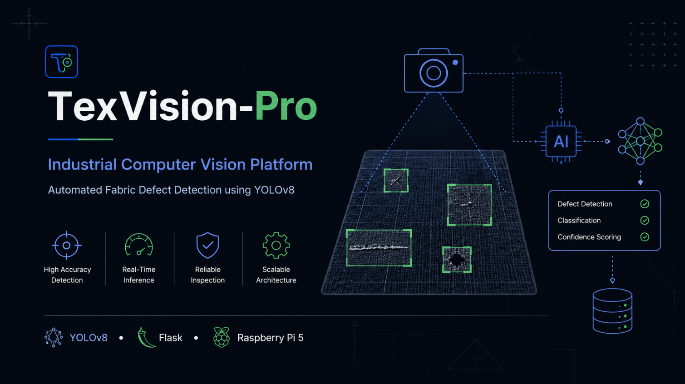
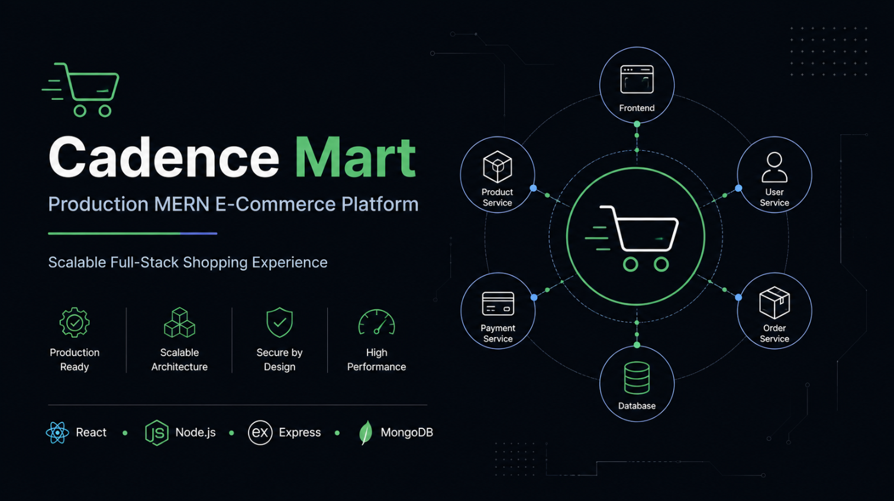
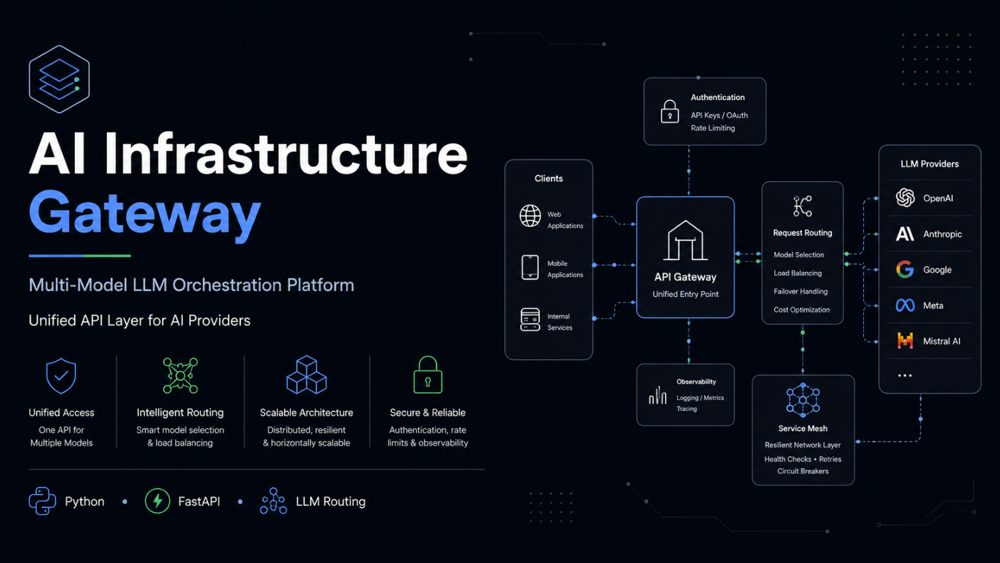
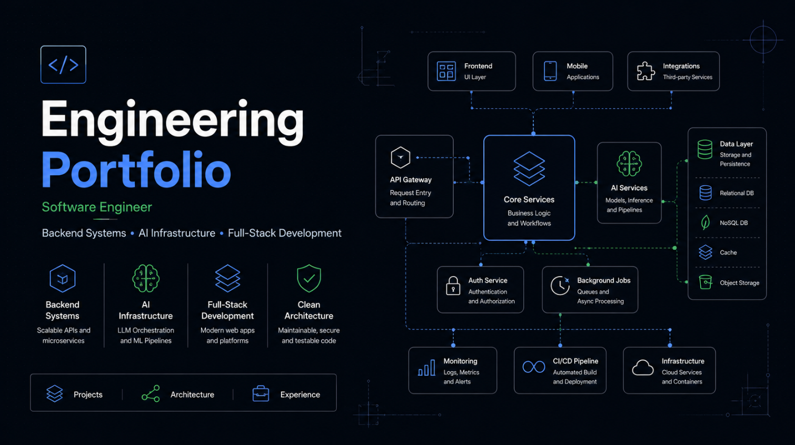

  

<h1 align="center">Hammad Khan</h1>

  <strong>Software Engineer</strong>

Building scalable software with a focus on backend systems, AI infrastructure, and production-ready architecture.

---

## About

I'm a Software Engineer focused on designing reliable software systems that solve real-world problems through clean architecture and thoughtful engineering.

My work spans backend development, AI-powered applications, industrial computer vision, full-stack web development, and intelligent automation. I enjoy building software that is scalable, maintainable, and designed for real-world deployment rather than demonstrations.

I believe great software is built by balancing simplicity, performance, and long-term maintainability.

---

## Featured Projects

| Project | Focus |
|----------|-------|
| **TexVision-Pro** | Industrial computer vision platform for automated fabric defect detection using YOLOv8 and Raspberry Pi 5. |
| **Cadence Mart** | Production-style full-stack e-commerce platform built with the MERN stack. |
| **AI Infrastructure Gateway** | Multi-model LLM gateway for unified AI orchestration and backend integration. |
| **Portfolio** | Interactive engineering portfolio showcasing projects, architecture, and technical work. |

---

## Core Technologies

<table>
<tr>
<td>

### Languages

- Python
- JavaScript
- SQL
- C++

</td>

<td>

### Backend

- Flask
- Node.js
- Express.js
- REST APIs

</td>
</tr>

<tr>
<td>

### AI & Computer Vision

- YOLOv8
- OpenCV
- TensorFlow
- LangChain

</td>

<td>

### Databases & Tools

- MongoDB
- SQLite
- MySQL
- Git

</td>
</tr>
</table>

---

## Current Focus

- Building production-ready backend systems
- Exploring AI infrastructure and distributed systems
- Developing intelligent software for real-world applications
- Open to Software Engineering opportunities

---

## Featured Products

<table>
<tr>
<td align="center" width="50%">

### TexVision-Pro

Industrial Computer Vision Platform

</td>

<td align="center" width="50%">

### Cadence Mart

Production MERN E-Commerce Platform

</td>

</tr>

<tr>

<td align="center">

### AI Infrastructure Gateway

Multi-Model LLM Platform

</td>

<td align="center">

### Portfolio

Software Engineering Portfolio

</td>

</tr>

</table>
---

## Connect

<a href="https://github.com/hammadk-devv">GitHub</a> •
<a href="https://www.linkedin.com/in/hammad-khan-a8229a352/">LinkedIn</a> •
<a href="mailto:hammadrx8@gmail.com">Email</a>

